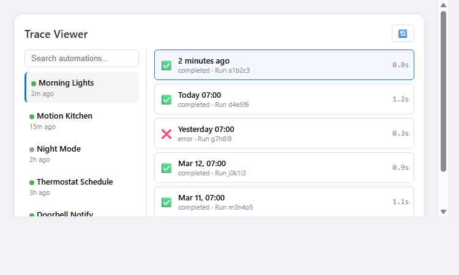
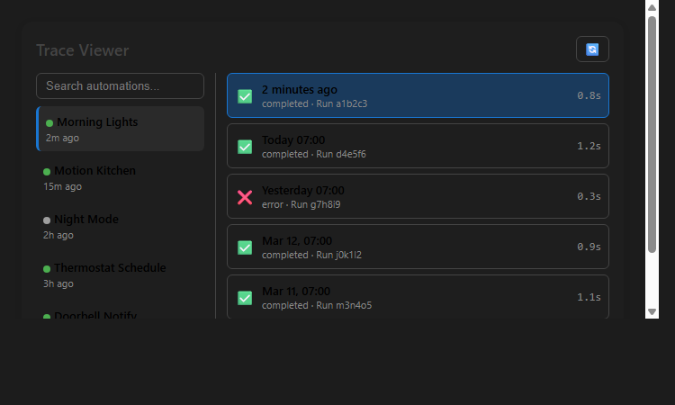

# Home Assistant Trace Viewer

[](https://github.com/MacSiem/ha-trace-viewer/actions/workflows/validate.yml)
[](https://github.com/hacs/integration)

A Lovelace card for Home Assistant that lets you browse, inspect, and export automation execution traces directly from your dashboard.



## Features

- Browse all automations sorted by last triggered time
- View execution traces with timeline visualization
- Inspect step-by-step execution with changed variables
- JSON view with syntax highlighting
- Export individual traces to JSON
- Search and filter automations
- Auto-refresh support
- Light and dark theme support

## Installation

### HACS (Recommended)

1. Open HACS in your Home Assistant
2. Go to Frontend → Explore & Download Repositories
3. Search for "Trace Viewer"
4. Click Download

### Manual

1. Download `ha-trace-viewer.js` from the [latest release](https://github.com/MacSiem/ha-trace-viewer/releases/latest)
2. Copy it to `/config/www/ha-trace-viewer.js`
3. Add the resource in Settings → Dashboards → Resources:
   - URL: `/local/ha-trace-viewer.js`
   - Type: JavaScript Module

## Usage

Add the card to your dashboard:

```yaml
type: custom:ha-trace-viewer
title: Trace Viewer
max_traces: 20
```

### Configuration

| Option | Type | Default | Description |
|--------|------|---------|-------------|
| `title` | string | `Trace Viewer` | Card title |
| `max_traces` | number | `20` | Maximum number of traces to display |
| `show_timestamps` | boolean | `true` | Show timestamps in trace steps |
| `auto_refresh` | number | `30` | Auto-refresh interval in seconds |
| `default_view` | string | `timeline` | Default view: `timeline` or `json` |

## Screenshots

| Light Theme | Dark Theme |
|:-----------:|:----------:|
|  |  |

## How It Works

The card uses Home Assistant's WebSocket API to fetch automation traces. Traces are created automatically each time an automation runs and are stored temporarily by Home Assistant.

The **Timeline view** shows step-by-step execution with variable changes and results. The **JSON view** provides the raw trace data with syntax highlighting for debugging.

You can export any trace as a JSON file for sharing or archiving.

## License

MIT License - see [LICENSE](LICENSE) file.
