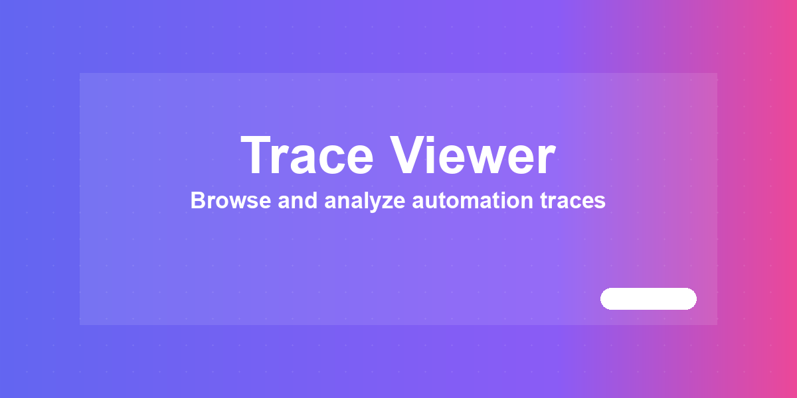
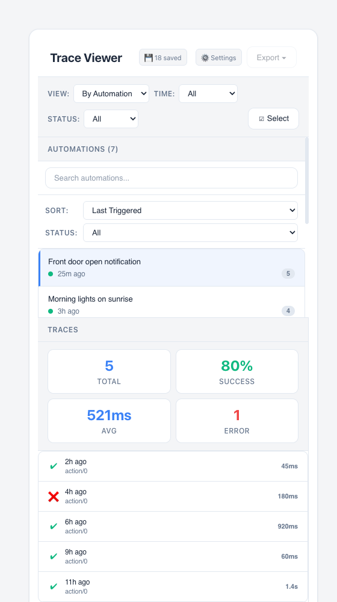
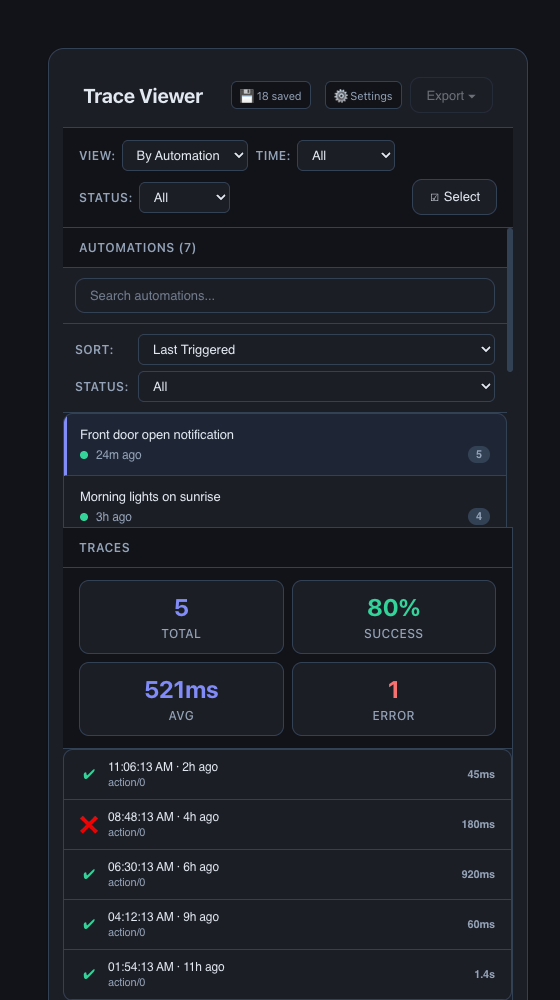

# HA Trace Viewer



Browse, inspect and export Home Assistant automation traces from a Lovelace
card — with success/error stats, a step-by-step timeline and JSON export.
Zero configuration: add the card and it discovers every `automation.*` entity.

[](https://github.com/MacSiem/ha-trace-viewer/releases) [](LICENSE)

## How it works

**Short version: it works automatically.** The card needs no configuration and
no extra integration:

1. **Automations from HA state.** On load, the card lists every `automation.*`
   entity with its status and last-triggered time — searchable, sortable and
   filterable.
2. **Traces via the native trace API.** Selecting an automation fetches its
   execution traces (`trace/list`), shows total / success rate / average
   duration / error stats, and each run can be opened for a step-by-step
   detail view (`trace/get`) with Timeline, JSON, Changes, Config and Related
   tabs.
3. **Beat the 5-trace limit.** Home Assistant keeps only the last 5 traces per
   automation by default and clears them on restart. The card can **save
   traces locally in your browser** (the "saved" counter in the header), so
   interesting runs survive restarts. You can also raise `stored_traces` per
   automation.

### What is automatic vs. manual

| Automatic | Manual (optional) |
|---|---|
| Discovering all automations | Nothing required to start |
| Trace stats (success rate, avg duration) | Saving selected traces locally |
| Trace detail timeline + flow view | Exporting traces to JSON / CSV |
| View preferences remembered | Raising `stored_traces` for more history |

## Screenshots

| Light | Dark |
|---|---|
|  |  |

*An automation selected: run stats (total, success rate, average duration,
errors) and the trace list. Dark mode follows your Home Assistant theme
automatically.*

## Installation

1. Open HACS → Custom repositories.
2. Add `https://github.com/MacSiem/ha-trace-viewer` as category **Dashboard**
   (Lovelace plugin).
3. Install **HA Trace Viewer** and reload your browser.

## Quick start

```yaml
type: custom:ha-trace-viewer
```

That's it — no options are required.

## Features

- **By Automation / All Traces views** with time-range, status and text filters.
- **Trace detail** — timeline of triggers / conditions / actions, raw JSON,
  config and related entities.
- **Multi-select + export** — export chosen traces as JSON or CSV (full detail
  is fetched via `trace/get`).
- **Local saving** — keep important traces in browser storage beyond HA's
  5-trace limit and across restarts.

## FAQ

**Do I have to configure anything?**
No. Add the card and it discovers your automations by itself.

**Why do I only see a few traces per automation?**
Home Assistant stores only the last 5 traces per automation by default and
clears them on restart. Save traces from the card, or raise `stored_traces`
in the automation config.

**Where are saved traces kept?**
In your browser's localStorage — per browser, per device. Clearing browser
data removes them; use Export (JSON/CSV) for permanent copies.

**Does this send data anywhere?**
No. Everything runs locally in your browser against your Home Assistant
instance — no telemetry, no CDN assets.

## Changelog

See [CHANGELOG.md](CHANGELOG.md).

## Support

- [Buy Me a Coffee](https://buymeacoffee.com/macsiem)
- [PayPal](https://www.paypal.com/donate/?hosted_button_id=Y967H4PLRBN8W)

## License

MIT, see [LICENSE](LICENSE).
