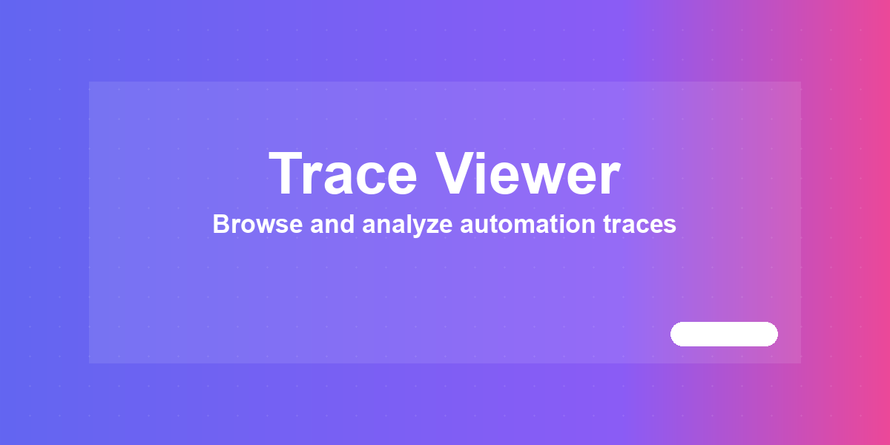
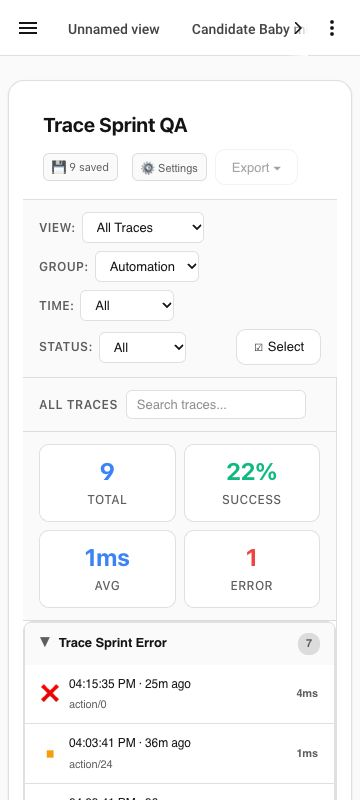
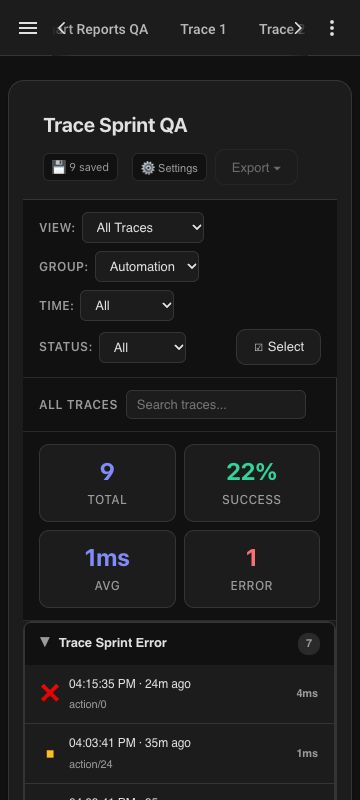

# HA Trace Viewer



Browse, inspect and export Home Assistant automation traces from a Lovelace
card — with success/error stats, a step-by-step timeline and JSON/CSV export.
Zero configuration: add the card and it discovers every `automation.*` entity.
Trace access requires a Home Assistant administrator account; household users
see a permission message without trace data or export controls.

[](https://github.com/MacSiem/ha-trace-viewer/releases) [](LICENSE)

## How it works

**Short version: it works automatically.** The card needs no configuration and
no extra integration:

1. **Automations from HA state.** On load, the card lists every `automation.*`
   entity with its status and last-triggered time — searchable, sortable and
   filterable.
2. **Traces via the native trace API.** Selecting an automation fetches its
   execution traces (`trace/list`), shows total / success rate / average
   duration / error stats, and each run can be opened for a step-by-step
   detail view (`trace/get`) with Timeline, JSON, Changes, Config and Related
   tabs.
3. **Browser history.** Home Assistant keeps the last 5 traces per automation
   by default. The card automatically retains fetched summaries in this browser
   (up to 2000 traces) and details you open (up to 200 details). Older opened
   details remain available when Home Assistant expires the run. Runs whose
   details were never opened may have only a saved summary. The card collects
   history while in use; it does not add a background server job.

The **Settings** button explains retention and sets traces per page. You can
also raise `trace.stored_traces` in your automation configuration; YAML
automations need an `id` for traces. See the
[Home Assistant trace configuration](https://www.home-assistant.io/docs/automation/troubleshooting/#trace-configuration).

### What is automatic vs. manual

| Automatic | Manual (optional) |
|---|---|
| Discovering all automations | Nothing required to start |
| Trace stats and fetched summaries saved locally | Opening details to retain them locally |
| Trace detail timeline + flow view | Exporting traces to JSON / CSV |
| View preferences remembered | Raising `stored_traces` for more history |

## Screenshots

| Light | Dark |
|---|---|
|  |  |

*Synthetic staging in a narrow Sections card: run stats (total, success rate, average
duration, errors) and the All Traces list. No household trace is shown. Dark mode
follows your Home Assistant theme.*

## Installation

1. Open HACS → Custom repositories.
2. Add `https://github.com/MacSiem/ha-trace-viewer` as category **Dashboard**
   (Lovelace plugin).
3. Install **HA Trace Viewer** and reload your browser.

## Quick start

```yaml
type: custom:ha-trace-viewer
```

That's it — no options are required.

## Features

- **By Automation / All Traces views** with time-range, status and text filters.
- **Trace detail** — timeline of triggers / conditions / actions, raw JSON,
  config and related entities.
- **Multi-select + export** — export chosen traces as JSON or CSV (full detail
  is fetched via `trace/get`).
- **Local saving** — keep important traces in browser storage beyond HA's
  5-trace limit and across restarts.

## Exporting and sharing

Select traces or automations, open **Export**, then choose JSON or CSV.
**Redact identifying data** is enabled by default. Redacted files contain
pseudonyms, the outcome and duration; JSON also reports whether details exist
and their step count. They omit names, entity/run identifiers, absolute times,
action paths, variables, service arguments and raw configuration. Review the
file before sharing it.

Uncheck redaction for a raw export. Raw JSON preserves full available details,
including locally retained details of expired runs; it may contain secrets and
household activity. Raw CSV contains run summaries. CSV quotes separators,
quotes and line breaks, and prefixes formula-like text with an apostrophe.
Keep raw files private.

## FAQ

**Do I have to configure anything?**
No. Add the card and it discovers your automations by itself.

**Why do I only see a few traces per automation?**
Home Assistant stores the last 5 traces per automation by default. Raise
`trace.stored_traces` to keep more on the server. This card's browser history
is separate and includes only runs fetched while the card is in use.

**Where are saved traces kept?**
In your browser's localStorage — per browser, per device. Clearing browser
data removes them; use Export (JSON/CSV) for permanent copies.

**Does this send data anywhere?**
No. Everything runs locally in your browser against your Home Assistant
instance — no telemetry, no CDN assets.

## Changelog

See [CHANGELOG.md](CHANGELOG.md).

## Support

- [Buy Me a Coffee](https://buymeacoffee.com/macsiem)
- [PayPal](https://www.paypal.com/donate/?hosted_button_id=Y967H4PLRBN8W)

The optional in-card support link is shown only to administrators. Dismiss it in the card or set `show_support: false` in the card configuration.

## License

MIT, see [LICENSE](LICENSE).

## Privacy and data

Automation traces can include entity identifiers, service arguments and household activity. Saved browser data belongs to the current Home Assistant origin and is not a shared backup. Review redacted exports before sharing; keep raw traces private.

See [SECURITY.md](SECURITY.md) for safe vulnerability reporting and [NOTICE](NOTICE) for licensing notices.

Polish regional locales such as `pl-PL` use the Polish dictionary consistently. Ordinary language updates translate optional support labels while preserving the search draft, focus and text selection, without reloading trace history. Dismissed support stays hidden.
